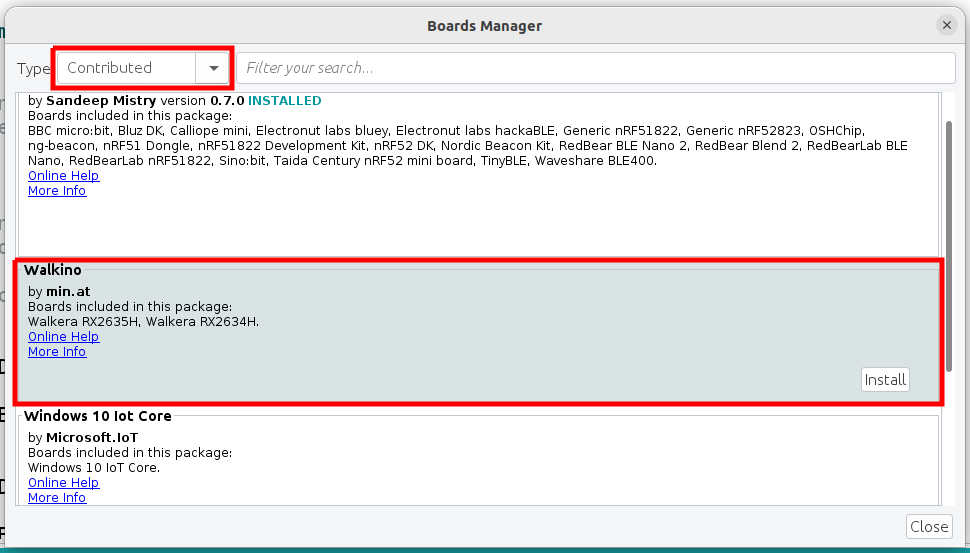

# Walkino

Programming your Walkera R/C receiver with the
Arduino IDE.

## Objectives

Basic idea for this project was to develop
alternate firmwares for some Walkera R/C receivers. After analyzing two popular receivers,
one the RX2634H from the [QR-Ladybird](https://www.google.com/search?q=qr-ladybird&tbm=isch) and the
other the RX2635H from the [Hoten-X](https://www.google.com/search?q=hoten-x&tbm=isch) both based
on the Atmel [XMEGA32A4](http://www.atmel.com/devices/ATXMEGA32A4.aspx) it looked feasible that
this could be done.

And whats the easiest way today to develop
software for microcontrollers? Right! It's the
Arduino IDE. So this project provides all
thats needed to integrate these board into the
Arduino IDE.

Successful tests where performed with legacy IDEs version 1.6.5 up to
the current version (as of this writing) 1.8.19.
as well as current  Arduino IDE v2.0.3.
Linux and Windows are equally supported, MAC OS was not tested.

Additional information about the hardware of
both receivers as well as for this project
could be found in a series of blog posts
about [Walkino](https://www.min.at/prinz/?x=cat:510).

Even if you are not into R/C quadcopters this
project could be interesting. The boards are
relatively cheap available on platforms like
Amazon or ebay and provide a great platform
for Atmel XMEGA based development and contain
a lot of interesting sensors.

## Installation

First install [Arduino IDE](https://www.arduino.cc/en/Main/Software).
Next you have two options to install this
project.

### Install as board package

This is the standard way to install Walkino.

1. Add the Walkino board index URL

   `https://raw.githubusercontent.com/rprinz08/Walkino/master/package_walkino_index.json`

   to the list of indices in the Arduino IDE settings as shown in the pictures below:

   a. for IDE v1.x

   **File/Preferences**
   

   b. for IDE v2.x

   **File/Preferences**
   

2. Install Walkino via board manager:

   a. for IDE v1.x

   **Tools/Board/Boards Manager**
   

   b. for IDE v2.x

   **Tools/Board/Boards Manager**
   

   This also automatically installs the required uploader tool UP42 for the host platform.

### Legacy install

The legacy install is usefull for older IDE's
which dont support installation of board
packages.

This method is deprecated and only available
for documentation purposes.

1. Download the distribution ZIP file end
   extract it into the root directory of the
   Arduino IDE (the folder
   which contains the file **arduino** which
   starts the IDE).

2. The other way is to clone the GIT repository
   right into the IDE folder. This has the
   advantage that updates could be easily done
   using **git update**.

Both methods do not overwrite or change any
files of the standard IDE installation and can
be completely removed using the provided
**walkino-remove.sh** (for Linux or
**walkino-remove.cmd** for Windows) script.

Included in this project are compiled binaries of
the [UP42](https://github.com/rprinz08/UP42)
utility which is needed to transfer compiled
sketches to the receiver. This is only required
for legaxy install! You could also compile it
yourself from source for security reasons if you
want. Versions for Windows and Linux are
provided as 32bit and 64bit binaries. If you are
on a 32bit system you have to manually rename
the 32bit versions **up42-32** to **up42** as
the default is 64bit. These utilities could be
found in the **hardware/tools/walkera/linux**
or **hardware/tools/walkera/windows** folders
inside the Arduino IDE folder.

To connect the receiver boards to the
development PC either an original Walkera UP02
or a USB to serial converter is needed.

More infos about that topic are available [here](https://www.min.at/prinz/?x=entry:entry150622-125650)
and [here](https://www.min.at/prinz/?x=entry:entry161004-215304).

## Usage

Select one of the two new boards which are
available After installation under the **Tools/Board** menu.
Then select the serial port where the board is
connected.

To start you can select one of the available
examples under menu **File / Examples / Walkino**

## Contributing / Developing

Walkino is not 100% complete or bug free. If you
found any bug or have an idea for improvements -
great! Feel free to contribute.

1. Fork it on github!
2. Create your feature branch: `git checkout -b my-new-feature`
3. Commit your changes: `git commit -am 'Add some feature'`
4. Push to the branch: `git push origin my-new-feature`
5. Submit a pull request :-)

To start development no dependencies except the
Arduino IDE are needed. I personally develop
using [Visual Studio Code](https://code.visualstudio.com) as an editor and this project
includes a workspace settings folder for it. If
you prefer another editor just ignore this
folder.

1. Open root folder of Arduino IDE with vscode
   and start coding. Especially files under
   **hardware/walkera/xmega/** are relevant if
   you would like to understand or modify things.

2. Press CTRL+SHIFT+B in vscode builds project
   dist ZIP file.

## Notes

Most of the receivers hardware is already
supported by Walkino. Serial port, red LED on
RX2635H and red/green LED on RX2634H, two I2C
and one SPI bus works. Components like ITG-3205
mems gyro and MMA-8452 are accessible via I2C
and libraries are included. The wireless USB
CYRF-6936 is accessible via SPI but currently
not supported as no library is included in
Walkino. Also measuring the current battery
voltage is supported.

The used receiver boards still use the original
Walkera bootloader so it's possible to flash
back original Walkera receiver firmware and use
them for what they were intended: as R/C
quadcopter receivers.

The original bootloader supports the feature to
specify an 80 byte identification string which
is shown by the bootloader ID command. Such an
ID could be specified with the **FW_ID**
preprocessor macro. Any string can be used as
long as it is less then or equal to 80 bytes
(including NULL C-string termination character)
and starts with **"Name:"**. It's valid if the
ID does not start with "Name:". In such a case
the bootloader does not report it back and uses
an empty string instead (even if the ID is
included in the firmware).

## History

* Alpha Version 17.2.2016
* First Public Beta 7.10.2016
* Update to support Arduino IDE v2 3.1.2023

## Credits

Credits go to all used components libraries.
Especially for some parts of
https://github.com/XMegaForArduino/arduino

Portions of this work are from the XMegaForArduino
project and are Copyright (c) 2015 by S.F.T.
Inc. - all rights reserved

## License

This software is provided 'as-is' with no
warranty, implied or otherwise.

**Walkino** copyright richard.prinz@min.at 2015 - 2023

This project is under GNU GPLv3.
See file gpl-3.0-walkino.txt in this project or
http://www.gnu.org/licenses/gpl-3.0.html
